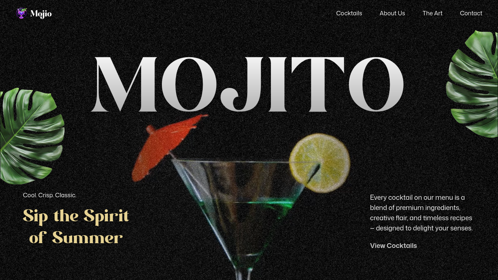

# Mojio — Cocktail & Mocktail Landing Page


> A modern, GSAP-powered landing page showcasing cocktails and mocktails with smooth scroll-controlled video animations.

---

## 🚀 Overview

**Mojio** is a visually rich landing page built with **React**, **GSAP**, and **TailwindCSS**.  
The highlight of this project is a **scroll‑scrubbable mojito video**, optimized using **FFmpeg** to create keyframe‑accurate playback for buttery‑smooth GSAP timeline control.

This project focuses on:

- Rich animations (GSAP + SplitText + ScrollTrigger)
- Motion‑driven UI components
- Smooth video timeline scrubbing using `currentTime`
- Aesthetic cocktail/mocktail collection UI
- Responsive layout using TailwindCSS + react‑responsive

---

## 🖥️ Project Screenshot



---

## 📁 Folder Structure

```bash
.
├── eslint.config.js
├── index.html
├── jsconfig.json
├── LICENSE
├── package.json
├── package-lock.json
├── public
│   └── vite.svg
├── README.md
├── src
│   ├── App.jsx
│   ├── assets
│   │   ├── constants
│   │   ├── fonts
│   │   ├── images
│   │   ├── index.js
│   │   └── videos
│   │       └── mojito.mp4
│   ├── components
│   │   ├── About.jsx
│   │   ├── Art.jsx
│   │   ├── Cocktails.jsx
│   │   ├── Contact.jsx
│   │   ├── Hero.jsx
│   │   ├── Menu
│   │   │   ├── CocktailMenu.jsx
│   │   │   └── index.jsx
│   │   └── Navbar.jsx
│   ├── index.css
│   └── main.jsx
└── vite.config.js
```

---

## 🎬 Video Optimization (FFmpeg)

To make the mojito.mp4 video scroll perfectly frame‑by‑frame using GSAP, FFmpeg was used to:

- scale the video down
- convert it to H.264
- force **every frame to be a keyframe**
- enable fast start streaming
- ensure browser compatibility

### 🔧 FFmpeg Command Used

```bash
ffmpeg -i input.mp4 -vf scale=960:-1 -movflags faststart -vcodec libx264 -crf 20 -g 1 -pix_fmt yuv420p output.mp4
```

### Why this command?

- `scale=960:-1` → reduce width for lighter file size
- `faststart` → instant load for scroll scrubbing
- `libx264` → best quality + performance
- `crf 20` → perfect visual-to-size balance
- `g 1` → **all frames are keyframes** (required for GSAP-controlled timeline scrubbing)
- `yuv420p` → browser-safe pixel format

---

## 🛠️ Tech Stack

### **Frontend**

- React 19
- Vite 7
- TailwindCSS 4
- GSAP + ScrollTrigger + SplitText
- react‑responsive

### **Tooling**

- ESLint + Prettier
- FFmpeg (video optimization)
- SWC-based React plugin for Vite

---

## ▶️ Scripts

```json
{
  "dev": "vite",
  "build": "vite build",
  "lint": "eslint .",
  "preview": "vite preview"
}
```

---

## 📦 Installation & Setup

```bash
git clone https://github.com/mdjunaid-11/mojio.git
cd mojio
npm install
npm run dev
```

---

## 🪪 License

[](./LICENSE)

This project is open-sourced under the MIT License © 2025 Md Junaid.

## 👨‍💻 Author

**Developer:** Md Junaid
**Project Type:** Personal Front-End Hobby Project
**GitHub:** [https://github.com/mdjunaid-11](https://github.com/mdjunaid-11)

---
